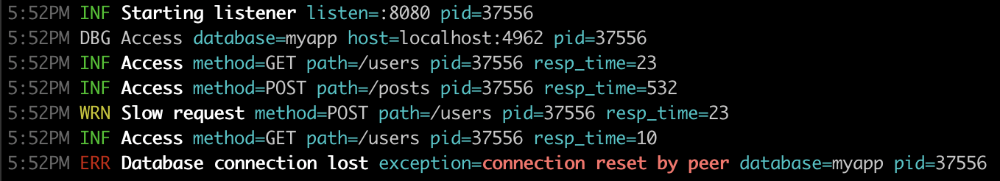

# zerolog [](https://codecov.io/gh/alexferl/zerolog)

Python logging with zero setup JSON output.

To keep the code base and the API simple, zerolog focuses on efficient structured logging only. Pretty logging on the console is made possible using the provided (but inefficient) [`zerolog.ConsoleWriter`](#pretty-logging).



## Getting started
### Install
```shell
pip install python-zerolog
```

### Simple Logging Example

```python
from zerolog import log

log.print("Hello, World!")

# {"level":"debug","time":"2023-12-14T23:23:57.922Z","message":"Hello, World!"}
```
> Note: By default log writes to `sys.stderr.buffer` and the default log level for `log.print` is `debug`.

### Leveled Logging
#### Simple Leveled Logging Example

```python
from zerolog import log

log.info().msg("Hello, World!")

# {"level":"info","time":"2023-12-14T23:36:47.768Z","message":"Hello, World!"}
```

### Contextual Logging

```python
from zerolog import log

log.debug().str("scale", "kg").float("weight", 42.69).msg("measuring in kilogram")

log.debug().str("Name", "Olivier").send()

# {"level":"debug","scale":"kg","weight":42.69,"time":"2023-12-14T23:32:26.368Z","message":"measuring in kilogram"}
# {"level":"debug","Name":"Olivier","time":"2023-12-14T23:32:26.368Z"}
```

### Exception Logging

You can log exceptions using the `exc` method.

```python
from zerolog import log

try:
    1/0
except Exception as e:
    log.exc(e).msg("uh oh")

# {"level":"error","exception":"division by zero","time":"2023-12-14T23:59:04.061Z","message":"uh oh"}
```
> Note: The default field name for exceptions is `exception`, you can change this by setting
> `zerolog.ExceptionFieldName` to meet your needs.

#### Exception Logging with Stack Trace

```python
import zerolog
from zerolog import log, stacktrace


def main():
    zerolog.ExceptionStackMarshaler = stacktrace.marshal_stack

    try:
        outer()
    except Exception as e:
        log.error().stack().exc(e).msg("uh oh")


def inner():
    1/0


def middle():
    inner()


def outer():
    middle()


# {"level":"error","stack":[{"source": "/app/test.py", "line": "9", "func": "main"}, {"source": "/app/test.py", "line": "23", "func": "outer"}, {"source": "/app/test.py", "line": "19", "func": "middle"}, {"source": "/app/test.py", "line": "15", "func": "inner"}],"exception":"division by zero","time":"2023-12-15T00:28:04.255Z","message":"uh oh"}
```
> Note: `zerolog.ExceptionStackMarshaler` must be set in order for `stack` to output anything.

#### Logging Fatal Messages

```python
from zerolog import log

log.fatal().msg("this is very bad")

# {"level":"fatal","time":"2023-12-15T00:22:03.664Z","message":"this is very bad"}
# exit status 1
```

#### Pretty logging
To log a human-friendly, colorized output, use `zerolog.ConsoleWriter`:

```python
import zerolog
from zerolog import log

zerolog.GlobalLogger = log.output(zerolog.ConsoleWriter(out=sys.stderr.buffer))

log.info().str("foo", "bar").msg("Hello World")

# 10:18PM INF Hello World foo=bar
```

To customize the configuration and formatting:
```python
import zerolog

output = zerolog.ConsoleWriter(out=sys.stdout.buffer, time_format=zerolog.TimeFormatRFC3339)
output.format_level = lambda i: f"| {i:6s}|".upper()
output.format_message = lambda i: f"***{i}****"
output.format_field_name = lambda i: f"{i}:"
output.format_field_value = lambda i: f"{i}".upper()

log = zerolog.new(output).ctx().timestamp().logger()

log.info().str("foo", "bar").msg("Hello World")

# 2023-12-23T23:11:48Z | INFO  | ***Hello World**** foo:BAR
```

### Log Sampling

```python
import zerolog
from zerolog import log

sampled = log.sample(zerolog.BasicSampler(n=10))
sampled.info().msg("will be logged every 10 messages")

# {"level":"info","time":"2023-12-22T21:34:15.205Z","message":"will be logged every 10 messages"}
```

More advanced sampling:
```python
import zerolog
from zerolog import log

# Will let 5 debug messages per period of 1 second.
# Over 5 debug message, 1 every 100 debug messages are logged.
# Other levels are not sampled.
sampled = log.sample(
    zerolog.LevelSampler(
        debug_sampler=BurstSampler(
            burst=5, period=1, next_sampler=zerolog.BasicSampler(n=100)
        )
    )
)
sampled.debug().msg("hello world")

# {"level":"debug","time":"2023-12-22T21:38:33.359Z","message":"hello world"}
```

### Hooks

```python
import zerolog
from zerolog import log

class SeverityHook:
    def run(self, e: zerolog.Event, lvl: zerolog.Level, msg: str):
        if lvl != zerolog.NoLevel:
            e.str("severity", lvl.string())


hooked = log.hook(SeverityHook())
hooked.warn().msg("")

# {"level":"warn","time":"2023-12-22T21:44:48.157Z","severity":"warn"}
```

## Global Settings

Some settings can be changed and will be applied to all loggers:

* `zerolog.GlobalLogger`: You can set this value to customize the global logger (the one used by package level methods).
* `zerolog.SetGlobalLevel`: Can raise the minimum level of all loggers. Call this with `zerolog.Disabled` to disable logging altogether (quiet mode).
* `zerolog.DisableSampling`: If argument is `true`, all sampled loggers will stop sampling and issue 100% of their log events.
* `zerolog.TimestampFieldName`: Can be set to customize `timestamp` field name.
* `zerolog.LevelFieldName`: Can be set to customize `level` field name.
* `zerolog.LevelTraceValue`: Can be set to customize `trace` level value.
* `zerolog.LevelDebugValue`: Can be set to customize `debug` level value.
* `zerolog.LevelInfoValue`: Can be set to customize `info` level value.
* `zerolog.LevelWarnValue`: Can be set to customize `warn` level value.
* `zerolog.LevelErrorValue`: Can be set to customize `error` level value.
* `zerolog.LevelFatalValue`: Can be set to customize `fatal` level value.
* `zerolog.MessageFieldName`: Can be set to customize `message` field name.
* `zerolog.ExceptionFieldName`: Can be set to customize `exception` field name.
* `zerolog.CallerFieldName`: Can be set to customize `caller` field name.
* `zerolog.CallerSkipFrameCount`: Can be set to customize the number of stack frames to skip to find the caller.
* `zerolog.CallerMarshalFunc`: Can be set to customize global caller marshaling.
* `zerolog.ExceptionStackFieldName`: Can be set to customize `stack` field name.
* `zerolog.ExceptionStackMarshaler`: Can be set to customize the function called to extract the stack from the exception if any.
* `zerolog.ExceptionMarshalFunc`: Can be set to customize global exception marshaling.
* `zerolog.AnyMarshalFunc`: Can be set to customize the function called for `any` marshaling.
* `zerolog.TimeFieldFormat`: Can be set to customize `time` field value formatting. If set with `zerolog.TimeFormatUnix`, `zerolog.TimeFormatUnixMs` or `zerolog.TimeFormatUnixMicro`, times are formatted as a UNIX timestamp. If set to `zerolog.TimeFormatRFC3339`, `zerolog.TimeFormatRFC3339Ms` or `zerolog.TimeFormatRFC3339Micro` the time is formatted as a RFC3339 date string.
* `zerolog.TimestampFunc`: Can be set to customize the function called to generate a timestamp.
* `zerolog.ExceptionHandler`: Called whenever zerolog fails to write an event on its output. If not set, an error is printed on the stderr. This handler must be thread safe and non-blocking.

## Field Types

### Standard Types

* `str`
* `bool`
* `int`
* `float`

### Advanced Fields

* `exc`: Takes an `Exception` and renders it as a string using the `zerolog.ExceptionFieldName` field name.
* `func`: Runs a function only if the level is enabled.
* `timestamp`: Inserts a timestamp field with `zerolog.TimestampFieldName` field name, formatted using `zerolog.TimeFieldFormat`.
* `time`: Adds a field with time formatted with `zerolog.TimeFieldFormat`.
* `any`: Uses `zerolog.AnyMarshalFunc` to marshal the value.

Most fields are also available in the list format (`strs` for `List[str]`, `bools` for `List[bool]` etc.)

## Credits

Based on the excellent [zerolog](https://github.com/rs/zerolog) in Go.
